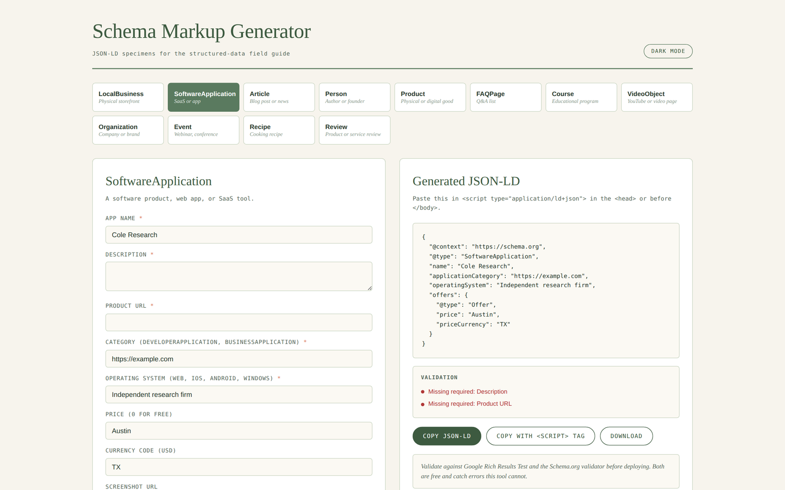

# schema-markup-generator

Generate JSON-LD schema markup for 12 schema types. Browser-only, no signup, no API calls.

**Live demo:** https://0xelitesystem.github.io/schema-markup-generator/

## What it does

Paste your page details, pick a schema type, get a validated JSON-LD block ready to drop into your `<head>`. Updates live as you type.

## Schema types supported

| Type | Use case |
|---|---|
| LocalBusiness | Physical storefront with address |
| SoftwareApplication | SaaS, web app, mobile app |
| Article | Blog post, news, editorial |
| Person | Founder, author, instructor |
| Product | Physical or digital good for sale |
| FAQPage | Q&A pages, help pages |
| Course | Educational program or class |
| VideoObject | YouTube videos, hosted video pages |
| Organization | Company without physical retail |
| Event | Webinar, conference, in-person event |
| Recipe | Cooking recipes |
| Review | Product or service reviews |

## Use it

Open `index.html` in any browser. Or visit `https://0xelitesystem.github.io/schema-markup-generator/`.

1. Pick a schema type from the grid at top.
2. Fill in fields. Required fields are marked with a coral asterisk.
3. JSON-LD updates live in the right panel.
4. Click "Copy JSON-LD" for the raw object, or "Copy with script tag" for paste-ready HTML.
5. Drop into your page `<head>` or just before `</body>`.

## Validation it does

- Required fields presence
- URL fields use absolute https
- Article headline under 110 characters
- `aggregateRating` requires both value and count

## Validation it does NOT do

This tool catches the most common errors. Before you ship, run the JSON-LD through:

1. [Google Rich Results Test](https://search.google.com/test/rich-results)
2. [Schema.org validator](https://validator.schema.org/)

Both are free. Both catch errors this tool cannot.

## Hard rules built in

- Never invent ratings, reviews, or counts. If `aggregateRating_value` is filled but `aggregateRating_count` is empty, the tool warns instead of fabricating.
- URLs are not auto-formatted. If you paste a URL without https://, validation warns.
- `availability` defaults to `InStock` for Product but is editable.

## What's not included

- No localStorage. Refresh clears your work. Copy or download before closing.
- No analytics, no tracking, no third-party scripts.
- No backend. Runs entirely in your browser.

## Pairs with

- [structured-data-examples](https://github.com/0xelitesystem/structured-data-examples): real-world JSON-LD examples for every type, ready to study and adapt
- [llms-txt-generator](https://github.com/0xelitesystem/llms-txt-generator): generate llms.txt for AI engine discovery
- [e-e-a-t-auditor](https://github.com/0xelitesystem/e-e-a-t-auditor): audit pages for E-E-A-T signals including schema presence
- [ai-citability-scorer](https://github.com/0xelitesystem/ai-citability-scorer): score content passages for AI citation likelihood

## License

MIT. Free to use, fork, modify, and ship.
